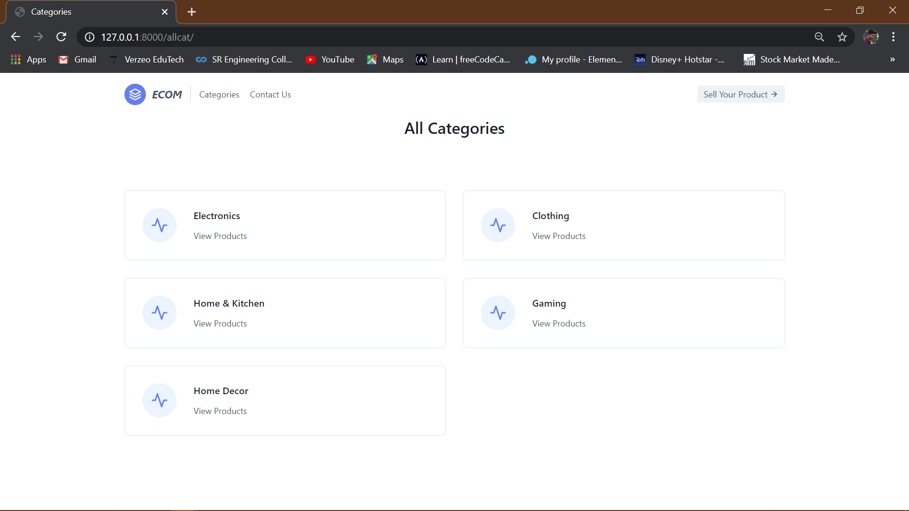

# E-Commerce Website
 A basic Ecommerce Website using   
 - Python
 - Django
 - HTML
 - CSS
 - JQuery   
 It includes CRUD(Create Read Update Delete) Operations.  
# Preview of Website
## Home Page

#### This is the view of Home Page of ECOM.    
In this page, You can   
- Select Products.   
- Navigate to other Pages.      
## Categories Page

#### This is the view of Categories Page of ECOM.  
In this page, You can   
- Select categories.       
- Navigate to other Pages.    
## Product Page

#### This is the view of Product Page of ECOM.      
In this page, You can   
- Read/View information of Products.    
- Create Products.   
- Update Products.   
- Delete Products.   
- Navigate to other Pages.           
## Contact Us Page

#### This is the view of Contact us Page of ECOM.      
In this page, You can Contact Us and we will get back to you as soon as possible.     
